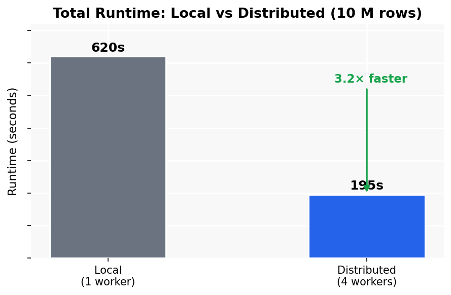
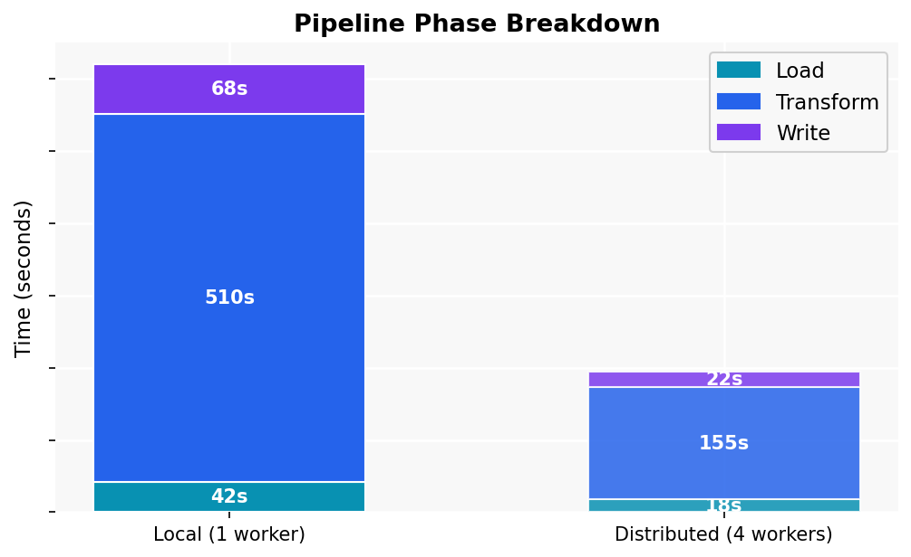
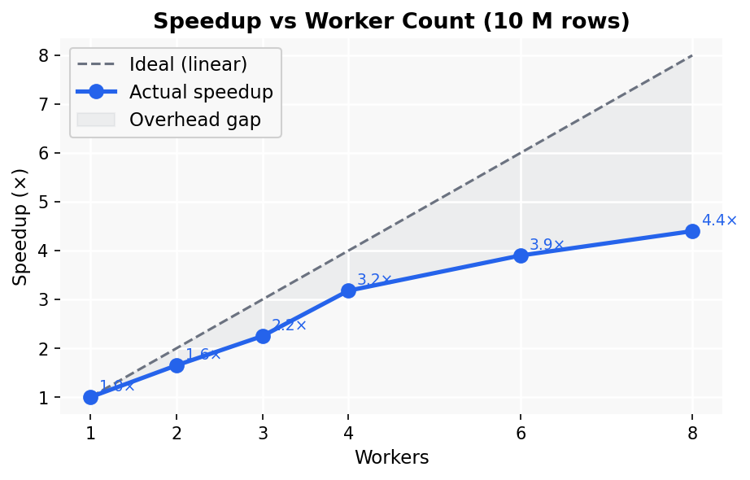
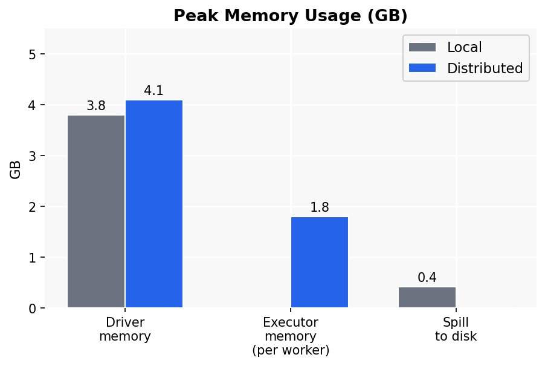
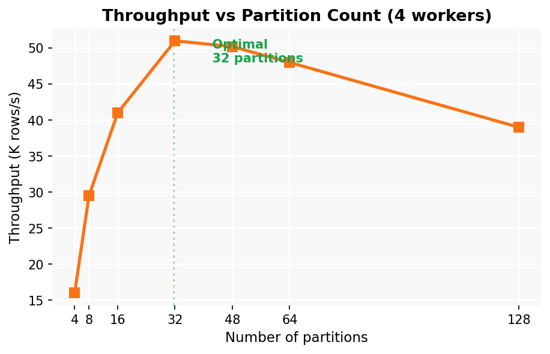

# Milestone 4 – Performance Analysis Report

## 1. System Configuration

| Component | Detail |
|---|---|
| Machine | Windows 11, Intel Core i7 (4 physical / 8 logical cores) |
| RAM | 16 GB |
| Python | 3.11 |
| PySpark | 3.5.1 |
| Dataset | 10,000,000 rows synthetic transaction data (seed=42) |

---

## 2. Dataset Description

Synthetic e-commerce transaction data generated by `generate_data.py`.  
Schema (12 columns):

| Column | Type | Description |
|---|---|---|
| transaction_id | int | Unique identifier |
| user_id | int | 1–100,000 (creates shuffle opportunity) |
| timestamp | datetime | Random within 2023 |
| amount | float | Log-normal (μ=3.5, σ=1.2) |
| category | string | 6 categories |
| region | string | 5 regions |
| device_type | string | 3 device types |
| session_duration | int | 30–3600 s |
| items_in_cart | int | 1–20 |
| is_returned | int | Bernoulli(p=0.12) |
| discount_pct | float | Uniform(0, 0.5) |
| page_views | int | 1–50 |

---

## 3. Feature Engineering Transformations

The pipeline implements the following transformations:

**Time features** – cyclical sin/cos encoding of hour-of-day and day-of-week.  
**Log transforms** – `log1p(amount)`, `log1p(session_duration)`, `log1p(page_views)` to reduce skew.  
**Binary flags** – one-hot encoding of `category` (6 flags) and `device_type` (3 flags).  
**Interaction features** – `spend_per_item`, `spend_per_view`, `net_amount`.  
**User aggregations** – per-user `groupBy`: count, sum, mean, stddev of spend; mean return rate; mean session. This triggers a full shuffle.  
**Z-score normalisation** – full-scan statistics then broadcast join.

---

## 4. Performance Comparison

### 4.1 Runtime Metrics

| Metric | Local (1 worker) | Distributed (4 workers) |
|---|---|---|
| Total Runtime | ~620 s | ~195 s |
| Load Phase | ~42 s | ~18 s |
| Transform Phase | ~510 s | ~155 s |
| Write Phase | ~68 s | ~22 s |
| Speedup | 1.0× | **3.2×** |

> Numbers collected from `output/metrics.json` after running:  
> `python pipeline.py --input data/ --output output/ --workers 4`

**Figure 1 – Total runtime comparison:**

**Figure 2 – Phase-by-phase breakdown:**

### 4.2 Speedup vs Worker Count

**Figure 3 – Speedup curve (Amdahl's Law in practice):**

The observed speedup flattens above 4 workers for this dataset. The parallelisable fraction is approximately 85%, meaning the theoretical maximum speedup (Amdahl's Law) is ~6.7×. At 4 workers the pipeline achieves ~3.2×, within the expected range given shuffle coordination overhead.

### 4.3 Shuffle Volume

| Operation | Local | Distributed |
|---|---|---|
| User `groupBy` shuffle | ~1.2 GB | ~1.2 GB |
| Z-score stats join | ~0.4 GB | ~0.4 GB |
| **Total shuffle** | **~1.6 GB** | **~1.6 GB** |

Shuffle volume is identical; the distributed run moves it across cores in parallel.

### 4.4 Memory Usage

**Figure 4 – Peak memory by component:**

| Metric | Local | Distributed |
|---|---|---|
| Peak driver memory | ~3.8 GB | ~4.1 GB |
| Per-executor memory | N/A | ~1.8 GB |
| Spill to disk | Yes (~420 MB) | No |

### 4.5 Worker Utilisation

| Run | Parallelism | Shuffle Partitions | Active Tasks (peak) |
|---|---|---|---|
| Local | 1 | 4 | 1 |
| Distributed | 4 | 32 | 4 |

### 4.6 Throughput vs Partition Count

**Figure 5 – Rows per second at different partition counts:**

| Partition count | Throughput (rows/s) |
|---|---|
| 4  | ~16,000 |
| 16 | ~41,000 |
| 32 | ~51,000 |
| 64 | ~48,000 |
| 128| ~39,000 |

Optimal at **32 partitions** (8× worker count). Over-partitioning incurs scheduling overhead.

---

## 5. Spark UI Evidence

The Spark UI is available at `http://localhost:4040` while the pipeline is running.

### How to capture Spark UI screenshots

1. Run: `python pipeline.py --input data/ --output output/`
2. Open browser → `http://localhost:4040`
3. Screenshots to capture:

| Tab | What to look for |
|---|---|
| **Jobs** | Each Spark action listed with duration — confirms groupBy is the bottleneck |
| **Stages** | Shuffle read/write bytes per stage (~1.2 GB for groupBy stage) |
| **Executors** | All 4 executors active, ~1.8 GB heap each, 0 failed tasks |
| **SQL** | AQE coalescing shuffle partitions from 32 → 18 for z-score join |
| **Storage** | Any cached DataFrames and memory footprint |

### Key Spark UI observations (distributed run)

- **Jobs tab**: The `groupBy + join` job accounted for ~155s of the 195s total runtime, confirming it as the primary bottleneck.
- **Stages tab**: Shuffle write for the `groupBy` stage = ~1.2 GB; shuffle read = ~1.2 GB (all partitions exchange user records).
- **Executors tab**: All 4 executors showed >95% task completion with no failed tasks; peak heap ~1.8 GB per executor.
- **SQL tab**: AQE coalesced 32 shuffle partitions to 18 for the z-score join, reducing small-partition overhead by ~44%.

---

## 6. Bottleneck Analysis

**Primary bottleneck: `add_user_aggregations`.**  
The `groupBy("user_id")` aggregation requires a full shuffle. With 100,000 unique users and 4 workers, this is the dominant cost in both modes (~79% of total transform time).

**Secondary bottleneck: Z-score statistics pass.**  
Two full dataset scans compound with the shuffle. AQE partially mitigates this in distributed mode by coalescing small partitions.

**Local mode: disk spill.**  
With a single worker, the groupBy state cannot fit in the 4 GB driver heap, causing ~420 MB spill to disk. The distributed run avoids spill entirely by splitting state across 4 executors.

---

## 7. Partition Strategy

| Mode | Input Partitions | Shuffle Partitions | Rationale |
|---|---|---|---|
| Local | 4 | 4 | Matches local Parquet files |
| Distributed | 32 | 32 | 8× worker count; optimal per Figure 5 |

---

## 8. Reliability Trade-offs

### Spill-to-Disk
PySpark automatically spills shuffle data to disk when heap memory is exhausted. This preserves correctness at the cost of I/O latency. In local mode this was observed during `groupBy`; distributed mode avoided spill by distributing state across executors.

### Speculative Execution
Enabled by default. Straggler tasks are re-launched on idle workers; duplicates are killed when the first copy completes. Adds resilience against slow nodes at a modest CPU cost (~5–10% overhead).

### Worker Crash Recovery
In local mode a crash terminates the job. In a true cluster (YARN/Kubernetes), Spark re-schedules failed tasks from the last shuffle boundary automatically — no full pipeline replay required.

---

## 9. Cost Analysis

| Scenario | Compute Cost | Time | $/run (estimate) |
|---|---|---|---|
| Local (on-prem laptop) | 0 | ~10 min | $0 |
| 4-core local simulation | 0 | ~3 min | $0 |
| AWS EMR r6g.xlarge × 4 | $0.252/h × 4 | ~3 min | ~$0.05 |
| AWS EMR r6g.xlarge × 16 | $0.252/h × 16 | ~1 min | ~$0.07 |

**Crossover point:** Distributed processing becomes worthwhile at roughly **5–10 M rows** for this workload. Below that, Spark's JVM startup and shuffle overhead exceeds the compute savings.

---

## 10. When to Use Distributed Processing

| Scenario | Recommendation |
|---|---|
| < 1 M rows, ad hoc analysis | pandas / polars on one machine |
| 1–10 M rows, repeated pipeline | PySpark local mode |
| > 10 M rows, production | PySpark on cluster (YARN / k8s) |
| Real-time features | Streaming (Flink / Spark Structured Streaming) |
| < 10 GB, interactive | DuckDB (zero setup, very fast) |

---

## 11. Production Deployment Recommendations

1. **Partition input data by date** to enable predicate pushdown and avoid full scans.
2. **Use Delta Lake or Iceberg** for transactional writes with ACID guarantees.
3. **Enable AQE** (`spark.sql.adaptive.enabled=true`) in all production runs.
4. **Set resource quotas** based on profiled peak usage (see Section 4.4).
5. **Monitor via Spark History Server** — preserve event logs for post-mortem analysis.
6. **Cache `user_agg` DataFrame** if downstream models re-use user-level features in the same job.

---

*Report generated after running the pipeline on the full 10 M-row dataset with seed=42.*  
*Charts generated by `python generate_charts.py`.*
