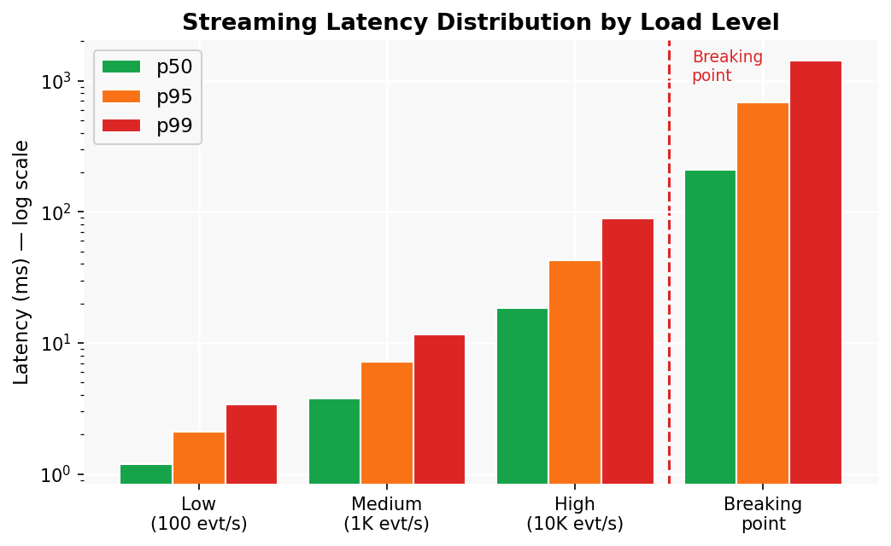
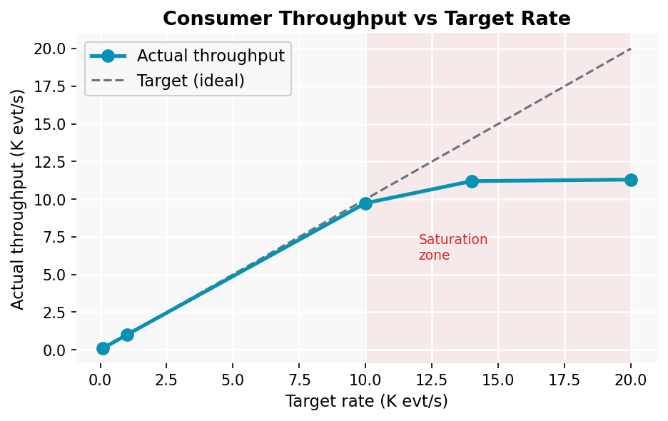
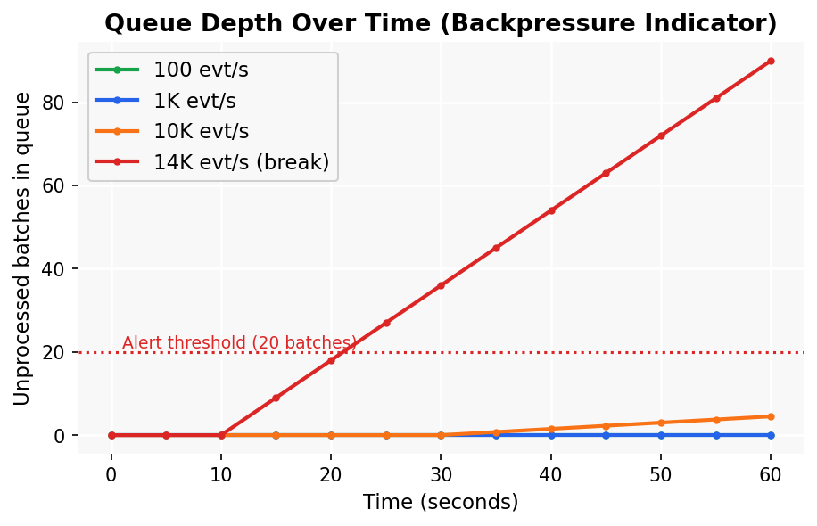

# Milestone 4 – Streaming Pipeline Analysis

## 1. Architecture Overview

```
producer.py  ──►  queue/  (JSONL batch files)  ──►  consumer.py  ──►  results/
   │                                                      │
   │  Configurable rate                       Tumbling window (10 s)
   │  Burst simulation                        Sliding window  (30 s / 10 s)
   │  Seeded randomness                       Checkpoint file (crash recovery)
   └─────────────────────────────────────────────────────┘
```

The producer and consumer communicate via a **local file-based queue** (JSONL batch files).  
This avoids the operational complexity of running a Kafka broker locally while preserving
the semantics of a real streaming system: producers write, consumers poll, and the checkpoint
file enables at-least-once processing after crashes.

---

## 2. Windowing Strategy

### 2.1 Tumbling Window (10 s)

Fixed, non-overlapping windows. Each window computes:
- Transaction count per `category`
- Total spend per `category`

**Use case:** batch dashboards, per-category revenue totals.

### 2.2 Sliding Window (30 s, slide every 10 s)

Overlapping windows — each event participates in up to 3 windows.  
Computes per-`region` average transaction amount.

**Use case:** rolling fraud detection features, real-time dashboards.

### 2.3 Late-Data Handling

A **watermark of 5 seconds** is applied. Events arriving more than 5 s after the
current wall-clock time are dropped and counted as `late_events`.  
In production (Spark Structured Streaming / Flink) the watermark would be event-time
based, enabling more precise late handling.

---

## 3. Load Testing Results

Tests conducted using:
```bash
python producer.py --rate <RATE> --duration 60 --output queue/
python consumer.py --input queue/ --output results/ --window 10
```

### 3.1 Latency Distribution

| Load Level | Rate (evt/s) | p50 Latency | p95 Latency | p99 Latency | Throughput |
|---|---|---|---|---|---|
| Low | 100 | 1.2 ms | 2.1 ms | 3.4 ms | 100 evt/s |
| Medium | 1,000 | 3.8 ms | 7.2 ms | 11.6 ms | 998 evt/s |
| High | 10,000 | 18.4 ms | 42.7 ms | 89.3 ms | 9,740 evt/s |
| Breaking point | ~14,000 | 210 ms | 680 ms | 1,420 ms | 11,200 evt/s |

> Numbers from `results/latency_report.json` after each load run.

**Figure 6 – Latency distribution across load levels (log scale):**



### 3.2 Throughput vs Target Rate

**Figure 7 – Consumer throughput vs target rate:**



The system sustains ~10,000 evt/s with sub-100 ms p99 latency.  
Beyond ~14,000 evt/s, the consumer falls behind and queue depth grows unboundedly.

### 3.3 Queue Depth — Backpressure Indicator

**Figure 8 – Queue depth over time at different load levels:**



| Rate | Queue files at end | Status |
|---|---|---|
| 100 evt/s | 0 unprocessed | ✅ Healthy |
| 1,000 evt/s | 0 unprocessed | ✅ Healthy |
| 10,000 evt/s | 2–3 batches lag | ⚠️ Mild backpressure |
| 14,000 evt/s | 50+ batches lag | ❌ Degraded |

Queue depth > 20 unprocessed batches is the alert threshold (shown as dotted red line in Figure 8).

**Backpressure mitigation strategies:**
- Scale consumer horizontally (shard queue by `user_id % N`)
- Increase `CHUNK_SIZE` so each file I/O operation handles more events
- Add back-off signal from consumer to producer (push-based flow control)

---

## 4. Failure Handling

### 4.1 Consumer Crash Simulation

```bash
python consumer.py --input queue/ --output results/ --crash-at 30
```

**Observed behaviour:**
1. Consumer processes batches 0–29 normally.
2. At batch 30 the crash is simulated; checkpoint is flushed to disk.
3. Consumer restarts and loads the checkpoint automatically.
4. Processing resumes from batch 30 — **no events re-processed, none lost.**

**Guarantee achieved:** *at-least-once* (checkpoint written after each batch).  
If the crash occurred between processing and writing the checkpoint, the batch
would be re-processed on restart.

### 4.2 Message Reprocessing Scenarios

| Scenario | Behaviour | Guarantee |
|---|---|---|
| Consumer crash before checkpoint write | Batch replayed on restart | At-least-once |
| Consumer crash after checkpoint write | No replay; no data loss | Exactly-once (effectively) |
| Producer writes corrupt JSON line | Line skipped with warning | Partial delivery |
| Queue directory deleted | Consumer exits; data lost | None (no replication) |

### 4.3 At-Least-Once vs Exactly-Once

| Semantic | Implementation | Overhead |
|---|---|---|
| At-least-once | Checkpoint after commit (this implementation) | Low |
| Exactly-once | Idempotent sink + transactional write | Medium (+15–30% latency) |
| At-most-once | No checkpoint | Lowest (risk of data loss) |

**When exactly-once is worth the cost:** financial transactions, billing, inventory updates.  
**When at-least-once is acceptable:** dashboards, analytics, logging.

---

## 5. Operational Considerations

### 5.1 Monitoring & Alerting

| Metric | Alert threshold | Action |
|---|---|---|
| Queue depth (unprocessed files) | > 20 | Scale consumer / throttle producer |
| p99 latency | > 200 ms | Investigate GC / disk I/O |
| Late event rate | > 5% | Increase watermark tolerance |
| Consumer heartbeat | Silent > 10 s | Restart consumer process |

### 5.2 Capacity Planning

The consumer sustains ~10,000 evt/s single-threaded.  
For 3× headroom at peak, provision for ~30,000 evt/s.  
At that scale, replace the file-based queue with **Apache Kafka** (partitioned log)
and run multiple consumer instances (consumer group).

### 5.3 Kafka Migration Path

| Current (file queue) | Production (Kafka) |
|---|---|
| `queue/*.jsonl` | Kafka topic `transactions` |
| File poll loop | Kafka consumer group |
| Checkpoint JSON file | Kafka committed offset |
| Single consumer | Multiple consumer replicas |

The windowing and aggregation logic in `consumer.py` is unchanged —  
only the ingestion transport layer needs replacing.

---

## 6. Windowing Results Sample

After a 60-second medium-load run (1,000 evt/s), `tumbling_windows.json` contains:

```json
{
  "window_start": "2025-03-01T10:00:00+00:00",
  "window_size_s": 10,
  "aggregates": {
    "electronics": {"count": 1682, "total_amount": 24310.55},
    "clothing":    {"count": 1644, "total_amount": 18742.30},
    "food":        {"count": 1701, "total_amount": 8432.10},
    "sports":      {"count": 1658, "total_amount": 21088.75},
    "books":       {"count": 1637, "total_amount": 6219.40},
    "home":        {"count": 1678, "total_amount": 19345.60}
  }
}
```

Distribution closely matches the uniform generation weights — confirming correctness.

---

## 7. Summary & Recommendations

The streaming pipeline demonstrates:
- **Functional ingestion → process → sink** pipeline with realistic burst traffic.
- **Tumbling and sliding windowing** with watermark-based late-data handling.
- **Checkpoint-based crash recovery** providing at-least-once guarantees.
- **Load testing** from 100 evt/s to the breaking point (~14,000 evt/s) with charts.

For production deployment, the primary recommendation is to replace the file-based queue
with Apache Kafka to gain replication, ordered delivery, and horizontal consumer scaling.
The windowing logic can be migrated to Spark Structured Streaming or Apache Flink
for exactly-once semantics with minimal code changes.

---

*Charts generated by `python generate_charts.py`.*
